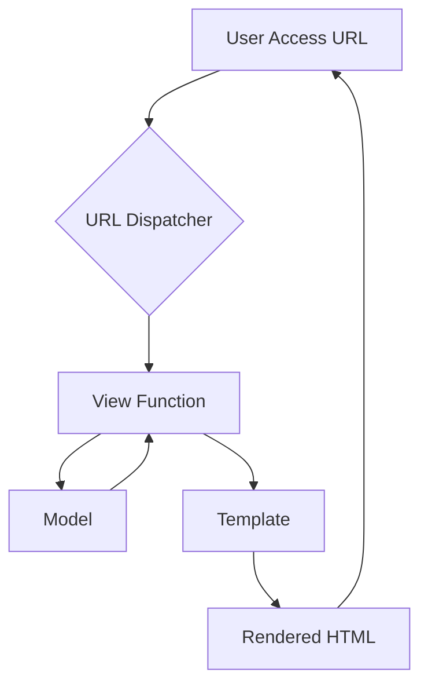

reference

[https://tutorial.djangogirls.org/ja/django/]

- [Usage](#usage)
- [Q\&A](#qa)
  - [python3 -m venv myvenv](#python3--m-venv-myvenv)
    - [A](#a)
  - [STATIC\_ROOT = BASE\_DIR / 'static'](#static_root--base_dir--static)
    - [A](#a-1)
  - [ALLOWED\_HOSTS = \['127.0.0.1', '.pythonanywhere.com'\]](#allowed_hosts--127001-pythonanywherecom)
    - [A](#a-2)
  - [\_\_ of title\_\_contains](#__-of-title__contains)
    - [A](#a-3)
  - [メソッドチェーンによる複雑なクエリ](#メソッドチェーンによる複雑なクエリ)
    - [A](#a-4)
  - [blog/views.py](#blogviewspy)
    - [A](#a-5)
  - [return render(request, 'blog/post\_list.html', {'posts': posts})](#return-renderrequest-blogpost_listhtml-posts-posts)
    - [A](#a-6)
  - [css更新したのに304になる](#css更新したのに304になる)
    - [A](#a-7)
  - [djangoのモデル、URL、ビュー、テンプレートの図](#djangoのモデルurlビューテンプレートの図)
    - [A](#a-8)
  - [djangoのモデル、URL、ビュー、テンプレートの作成手順](#djangoのモデルurlビューテンプレートの作成手順)
    - [A](#a-9)
  - [{{}} of Django](#-of-django)
    - [A](#a-10)

# Usage

```bash
$ python3 -m venv myvenv

$ . myvenv/bin/activate

$ python -m pip install --upgrade pip

$ pip install -r requirements.txt

$ python manage.py migrate

$ python manage.py runserver
```

URL:  
[http://127.0.0.1:8000/]

reference:  
[https://tutorial.djangogirls.org/ja/django_models/]

```bash
$ python manage.py makemigrations blog

$ python manage.py migrate blog
```

reference:  
[https://tutorial.djangogirls.org/ja/django_admin/]

URL:
[http://127.0.0.1:8000/admin]

# Q&A

## python3 -m venv myvenv

### A

もちろんです、では簡単な言葉で説明してみますね。

あなたがおもちゃをたくさん持っていて、それぞれが違う場所で遊ぶためのものだと想像してみてください。例えば、ビーチで遊ぶためのおもちゃや、雪で遊ぶためのおもちゃ、公園で遊ぶためのおもちゃなどです。

ただ、全部のおもちゃを同じ箱に入れてしまうと、遊び場所を変える度に全部のおもちゃを持っていくことになってしまい、大変ですよね。そして、ビーチで雪遊びのおもちゃを持って行くのは無意味ですし、逆もまた然りです。

ここで、遊び場所ごとにおもちゃ箱を作ったらどうでしょう？ビーチ用のおもちゃ箱、雪遊び用のおもちゃ箱、公園遊び用のおもちゃ箱を作ることで、遊び場所によって必要なおもちゃだけを簡単に持って行けますね。

`python3 -m venv myvenv` は、それと同じようなことをするコマンドです。このコマンドは、Pythonのプログラム（おもちゃ）を実行するための特別な場所（おもちゃ箱）を作ってくれます。これを「仮想環境」と言います。

つまり、プロジェクトごとに異なる「おもちゃ箱」（仮想環境）を作ることで、プロジェクトごとに必要なPythonのプログラムだけを持って行くことができるのです。これにより、プロジェクト間で必要なプログラムが混ざったり、衝突したりするのを避けることができます。

## STATIC_ROOT = BASE_DIR / 'static'

### A

もちろんです、小学生にも分かるように説明しますね。

想像してみてください、あなたが巨大な図書館の司書さんだとします。そしてその図書館には、たくさんの種類の本があります。あなたの仕事は、すべての本を適切な場所に整理して、訪れる人々が簡単に本を見つけられるようにすることです。

そのために、あなたは本を特定のカテゴリーに分けて、それぞれのカテゴリーに対して固定の場所を決めます。例えば、「歴史の本」は「歴史の本棚」に、「科学の本」は「科学の本棚」に置くことにします。それぞれの本棚には特定のラベルがつけられ、それによって誰もが自分が探している本がどの本棚にあるかを簡単に見つけることができます。

`STATIC_URL`と`STATIC_ROOT`は、ウェブサイトを作るときの「本」を整理する方法に似ています。ウェブサイトには「静的ファイル」というものがあります。これらは、画像やCSS（ウェブサイトのデザインを決めるコード）、JavaScript（ウェブサイトに動きをつけるコード）など、ウェブサイトを表示するのに必要なファイルのことを指します。

`STATIC_URL`は、これらの静的ファイルへの「ラベル」または「道しるべ」のようなものです。この設定により、ウェブブラウザ（図書館を訪れる人々）はどこで静的ファイル（本）を見つけられるかを知ることができます。

一方、`STATIC_ROOT`は、すべての静的ファイルが集められて保存される場所、つまり「本棚」のようなものを指します。この場所に静的ファイルを集めておくことで、ウェブブラウザは効率的にこれらのファイルを見つけてウェブサイトを表示することができます。

つまり、これらの設定は、静的ファイルを整理して管理する方法をDjangoに教えてくれるものなのです。

## ALLOWED_HOSTS = ['127.0.0.1', '.pythonanywhere.com']

### A

もちろんです、わかりやすく説明しますね。

想像してみてください。あなたの家にはいくつかの扉がありますね。それぞれの扉からは特定の人々だけが入ることができます。例えば、正面玄関からは家族だけが入れるとします。裏口からはあなたの親友だけが入れるとしましょう。これがあると、家に入ってくる人々を制御することができ、安全を保つことができます。

この `ALLOWED_HOSTS` の設定も同じようなことを行います。これはあなたが作成したウェブサイト（あなたの「家」）に訪れることができる「訪問者」（ユーザーのコンピューター）を制御します。このリストに含まれるアドレスからの訪問者だけがあなたのウェブサイトを見ることができます。

例えば、`ALLOWED_HOSTS = ['127.0.0.1', '.pythonanywhere.com']` の場合、'127.0.0.1'（これは自分自身のコンピューターを指す特別なアドレスです）と、'pythonanywhere.com'という名前が含まれるどんなアドレスからも、あなたのウェブサイトを見ることができます。

これにより、ウェブサイトが安全に運用され、許可された訪問者だけがあなたのウェブサイトを訪れることができるようになります。

## __ of title__contains 

### A

例えば、お部屋にいろんなおもちゃがあるとします。それぞれのおもちゃには名前がついています。さて、"レゴ"という名前のおもちゃを探したいとき、どうしますか？

ここで、Djangoというソフトウェアがお手伝いしてくれます。Djangoに、「レゴ」の名前が含まれるおもちゃを探すようにお願いします。そのときに使う命令が、「title__contains」というものです。

ここで「title」はおもちゃの名前を意味していて、「contains」は「含む」という意味です。「__」（アンダーバー2つ）は、この二つの単語をつなげて、「名前にレゴを含む」という意味にするために使います。

もしアンダーバーが1つだけだったら、Djangoはそれを一つの言葉、「title_contains」と理解してしまい、そんなおもちゃの名前はないからエラーになってしまいます。だから、ここではアンダーバーを2つ使って、名前（title）と含む（contains）をつなげています。

## メソッドチェーンによる複雑なクエリ

### A

わかりました！これを小学生が理解できるように説明してみますね。

想像してみてください、あなたが図書館の司書さんで、たくさんの本がある大きな図書館を管理しています。図書館に来た人が「今日の日付より前に発売された本を、発売日順に見せてほしい」とお願いしたとします。どうやってそのリクエストに答えますか？

このリクエストを満たすためには、2つの作業が必要です。まず、今日の日付より前に発売された本を探し出します。次に、その本を発売日順に並べ替えます。

ここで、Djangoの「メソッドチェーン」が役立ちます。それは、一連の指示をつなげて一度に実行する方法です。「filter」は本を選び出すための指示、「order_by」は本を並べ替えるための指示です。そして、これらを「.」（ドット）でつなげることで、一度にこれらの作業を行うことができます。

つまり、「Post.objects.filter(published_date__lte=timezone.now()).order_by('published_date')」という命令は、「今日より前に発売された本を選び出して、それを発売日順に並べ替えてね」というリクエストと同じようなものです。

メソッドチェーンを使うと、1つの命令で複数の作業を行うことができます。だから、複雑な要求があったときにとても便利なんですよ。

## blog/views.py

```python
def post_list(request):
    posts = Post.objects.filter(published_date__lte=timezone.now()).order_by('published_date')
    return render(request, 'blog/post_list.html', {'posts': posts})
```

### A

わかりました！まず、上記のコードはPythonという言語で書かれたプログラムの一部で、特にDjangoというツールを使っています。Djangoはウェブサイトを作るためのツールです。

このプログラムの中でやっていることを例を使って説明しますね。

まず、あなたが宝物探しのゲームをするとします。目指す場所は「お城」としましょう。道中で友だち（ここでは「request」）からヒントをもらいます。この「post_list」という名前の関数（道案内人）がそのヒントを元に宝物（ここでは「posts」）を探しに行きます。

この「道案内人」は特別な地図（ここでは「Post.objects.filter(published_date__lte=timezone.now()).order_by('published_date')」）を使って、過去に隠された宝物（ブログの記事）を発見日の古い順に探し出します。

そして、宝物を見つけたら、道案内人はそれを元の場所（ここでは「blog/post_list.html」、つまりあなたのウェブサイトの特定のページ）に持って帰ります。それと同時に、道案内人はどの宝物がどれだったかをリストにして友だち（ここでは「request」）に見せます。

つまり、この関数はウェブサイトの訪問者（友だち）が「post_list」ページを要求したときに、すでに公開されたブログの投稿（宝物）を古い順に取得し、それを'blog/post_list.html'ページに表示するようにDjangoに指示している、というわけです。

## return render(request, 'blog/post_list.html', {'posts': posts})

### A

想像してみてください。あなたが友だちの家に遊びに行くとします。友だちがあなたに部屋を見せてくれるでしょう。部屋にはたくさんのものがあるかもしれませんが、友だちが「これ、見て！これは私の宝物のコレクションだよ」と言って、宝物の箱をあなたに見せるとしましょう。

この例を元に説明すると、`{'posts': posts}`はまさにその「これは私の宝物のコレクションだよ」と言っている部分にあたります。ここでの`posts`は友だちの宝物のコレクション（ブログの投稿リスト）を意味しています。そして`'posts'`は、そのコレクションの名前（ラベル）です。

そして、`render`関数は友だちの家（ウェブページ）を見せる役割を果たしています。`request`は友だちの家に遊びに来たあなた（ウェブページを見たいとリクエストした人）を表しています。そして`'blog/post_list.html'`は、友だちがあなたに見せる部屋（具体的なウェブページの場所）です。

だから、この行は「あなたが"blog/post_list.html"という部屋を訪れたとき、私の宝物のコレクション（posts）を見せるよ」という意味になります。そして、その宝物のコレクションは、ウェブページで表示するためのデータとして使われます。

## css更新したのに304になる

### A

HTTPステータスコード304は"Not Modified"を意味します。これは、ブラウザが以前にキャッシュしたリソース（この場合はblog.cssファイル）を再利用していることを示しています。ブラウザは通常、リソースが以前にダウンロードされ、ローカルキャッシュに保存されているかどうかを確認します。もしリソースが変更されていなければ、サーバーはHTTP 304レスポンスを返し、ブラウザはキャッシュからそのリソースをロードします。

blog.cssファイルを更新したにも関わらず、変更がブラウザに反映されていない場合、以下の手順で問題を解決できるかもしれません：

1. **ブラウザのキャッシュをクリアする**： ほとんどのブラウザでは、ツールメニューや設定からキャッシュをクリアするオプションが提供されています。これにより、ブラウザは再度リソースをサーバーから取得し、最新のバージョンを表示するはずです。

2. **ハードリロードを試みる**： ブラウザのリロードボタンを押しながらShiftキーを押すと、強制的にブラウザが最新のリソースをサーバーから取得します。これは特に開発中に有用な手段です。

3. **開発サーバーを再起動する**： 開発中に静的ファイルが更新されない場合、Django開発サーバーを再起動することで問題が解決する場合があります。

これらの手順の後でも問題が解決しない場合は、他の要因（例えば、CSSファイルへのパスが間違っているなど）が問題を引き起こしている可能性があります。その場合は、さらに詳細な情報が必要となります。

## djangoのモデル、URL、ビュー、テンプレートの図

### A

Djangoのモデル、URL、ビュー、テンプレートの動きは以下のような流れで表現できます。以下はmermaid形式の図です。



この図の解釈は以下の通りです：

1. ユーザーがウェブアプリケーションの特定のURLにアクセスします。

2. DjangoのURLディスパッチャーは、そのURLが何に対応するか決定します。これはURLconf（URL設定）に基づいて行われます。

3. URLディスパッチャーは対応するビュー関数を呼び出します。

4. ビュー関数は必要なデータを取得するためにモデルを使います。この時、データベースとの対話が行われます。

5. ビューは取得したデータをテンプレートと一緒に渡します。

6. テンプレートは渡されたデータを使ってHTMLを生成します。

7. 最終的に生成されたHTMLがユーザーのブラウザに表示されます。

以上が基本的なDjangoの動作の流れとなります。

## djangoのモデル、URL、ビュー、テンプレートの作成手順

### A

Djangoでウェブアプリケーションを作る際の基本的な手順は以下のようになります。ここでは、ブログポストを表示するシンプルなアプリケーションを作成する例を使用します。

1. **モデルの作成**

    まずはデータベースのテーブルを定義します。それぞれのテーブルはDjangoの`models.Model`を継承したクラスとして定義され、クラスのフィールドがテーブルの列に対応します。例えば、ブログポストを表現するためのモデルは以下のようになります：

    ```python
    from django.db import models

    class Post(models.Model):
        title = models.CharField(max_length=200)
        content = models.TextField()
        pub_date = models.DateTimeField('date published')
    ```

2. **モデルのマイグレーション**

    モデルを作成したら、そのモデルをデータベースに反映するためにマイグレーションを作成し、適用します：

    ```bash
    python manage.py makemigrations
    python manage.py migrate
    ```

3. **URLの設定**

    次に、ビューをブラウザからアクセス可能にするためにURLを設定します。これは`urls.py`ファイルで行います：

    ```python
    from django.urls import path

    from . import views

    urlpatterns = [
        path('', views.post_list, name='post_list'),
    ]
    ```

4. **ビューの作成**

    ビューは、特定のURLがリクエストされたときに何を行うかを決定します。この場合、ビューは`Post`モデルからデータを取得し、それをテンプレートに渡します：

    ```python
    from django.shortcuts import render
    from .models import Post

    def post_list(request):
        posts = Post.objects.order_by('pub_date')
        return render(request, 'blog/post_list.html', {'posts': posts})
    ```

5. **テンプレートの作成**

    最後に、ビューが使用するテンプレートを作成します。これはHTMLファイルで、Djangoテンプレート言語を使用して動的な部分を記述します：

    ```html
    
        <h2>{{ post.title }}</h2>
        <p>{{ post.content }}</p>
    
    ```

以上が基本的な流れです。この一連の流れを通じて、データベースからデータを取得し、それを適切にフォーマットしてユーザーに表示するウェブページを作成することができます。

## {{}} of Django

### A

Djangoの`{{}}`記法は、Djangoテンプレートエンジンに特有のもので、テンプレート中に変数を表示するための構文です。具体的には、ビューからテンプレートに渡された変数の値をHTML中に挿入する際に使用します。

例えば、次のようなビュー関数があったとします。

```python
def post_list(request):
    posts = Post.objects.all()
    return render(request, 'blog/post_list.html', {'posts': posts})
```

ここでは`posts`という名前の変数にPostモデルの全てのオブジェクトを格納し、それを`blog/post_list.html`テンプレートに渡しています。

そして、このテンプレート中で`posts`変数を表示するために`{{}}`記法を使用します。

```html

    <h2>{{ post.title }}</h2>
    <p>{{ post.content }}</p>

```

上記のコードでは、`post.title`や`post.content`など、`posts`変数に格納されている各Postオブジェクトのフィールドを表示するために`{{}}`を使っています。

なお、`{{}}`記法をGoogleなどで検索する際は、「Django テンプレート 変数」といったキーワードを使用すると、関連する情報が見つけやすくなります。一般的な記号や特殊文字だけで検索を行うと、検索エンジンがそれを無視してしまうことがあります。