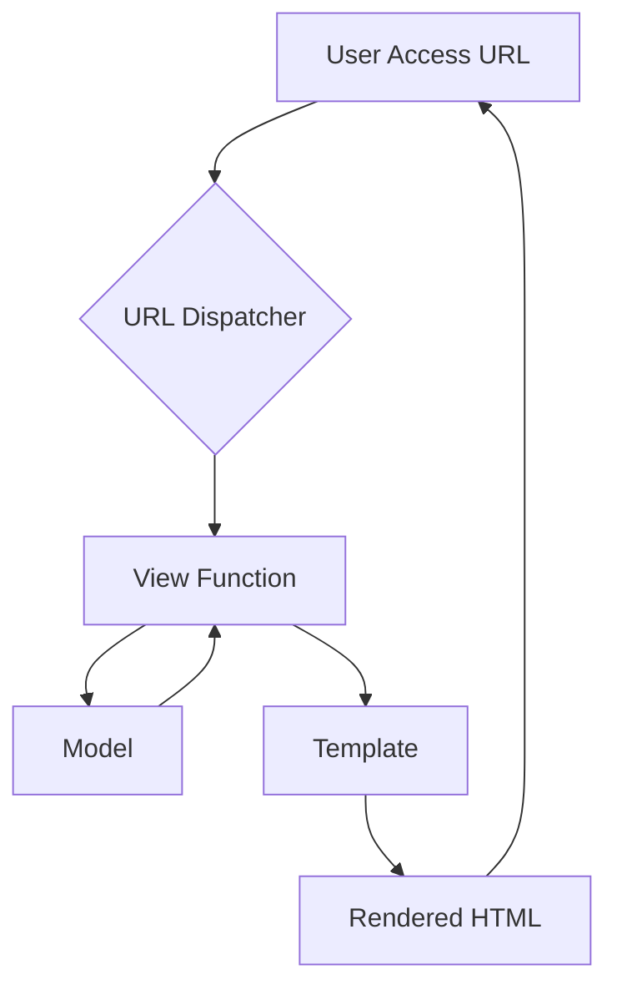

reference

[https://tutorial.djangogirls.org/ja/django/]

- [Usage](#usage)
  - [local](#local)
  - [pythonanywhere](#pythonanywhere)
  - [maze\_game](#maze_game)
- [Q\&A DjangoGirls](#qa-djangogirls)
  - [python3 -m venv myvenv](#python3--m-venv-myvenv)
    - [A](#a)
  - [STATIC\_ROOT = BASE\_DIR / 'static'](#static_root--base_dir--static)
    - [A](#a-1)
  - [ALLOWED\_HOSTS = \['127.0.0.1', '.pythonanywhere.com'\]](#allowed_hosts--127001-pythonanywherecom)
    - [A](#a-2)
  - [\_\_ of title\_\_contains](#__-of-title__contains)
    - [A](#a-3)
  - [メソッドチェーンによる複雑なクエリ](#メソッドチェーンによる複雑なクエリ)
    - [A](#a-4)
  - [blog/views.py](#blogviewspy)
    - [A](#a-5)
  - [return render(request, 'blog/post\_list.html', {'posts': posts})](#return-renderrequest-blogpost_listhtml-posts-posts)
    - [A](#a-6)
  - [css更新したのに304になる](#css更新したのに304になる)
    - [A](#a-7)
  - [djangoのモデル、URL、ビュー、テンプレートの図](#djangoのモデルurlビューテンプレートの図)
    - [A](#a-8)
  - [djangoのモデル、URL、ビュー、テンプレートの作成手順](#djangoのモデルurlビューテンプレートの作成手順)
    - [A](#a-9)
  - [{{}} of Django](#-of-django)
    - [A](#a-10)
- [Q\&A make maze with Django](#qa-make-maze-with-django)
  - [概要](#概要)
  - [model](#model)
  - [model directory](#model-directory)
  - [python manage.py startapp maze\_game](#python-managepy-startapp-maze_game)
  - [view](#view)
  - [template maze.html](#template-mazehtml)
  - [template](#template)
  - [template create\_maze etc](#template-create_maze-etc)
  - [misite/urls.py](#misiteurlspy)
  - [以下のアクセスは200OKでうまく行ったのですが、](#以下のアクセスは200okでうまく行ったのですが)
  - [以下のやり方を教えて](#以下のやり方を教えて)
  - [](#)

# Usage

## local

```bash
$ python3 -m venv myvenv

$ . myvenv/bin/activate

$ python -m pip install --upgrade pip

$ pip install -r requirements.txt

$ python manage.py migrate

$ python manage.py runserver
```

URL:  
[http://127.0.0.1:8000/]

reference:  
[https://tutorial.djangogirls.org/ja/django_models/]

```bash
$ python manage.py makemigrations blog

$ python manage.py migrate blog
```

reference:  
[https://tutorial.djangogirls.org/ja/django_admin/]

URL:
[http://127.0.0.1:8000/admin]

## pythonanywhere

```bash
$ git pull

$ workon <your-pythonanywhere-domain>.pythonanywhere.com

$ python manage.py collectstatic
```

## maze_game

```bash
$ python manage.py startapp maze_game
```

# Q&A DjangoGirls

## python3 -m venv myvenv

### A

もちろんです、では簡単な言葉で説明してみますね。

あなたがおもちゃをたくさん持っていて、それぞれが違う場所で遊ぶためのものだと想像してみてください。例えば、ビーチで遊ぶためのおもちゃや、雪で遊ぶためのおもちゃ、公園で遊ぶためのおもちゃなどです。

ただ、全部のおもちゃを同じ箱に入れてしまうと、遊び場所を変える度に全部のおもちゃを持っていくことになってしまい、大変ですよね。そして、ビーチで雪遊びのおもちゃを持って行くのは無意味ですし、逆もまた然りです。

ここで、遊び場所ごとにおもちゃ箱を作ったらどうでしょう？ビーチ用のおもちゃ箱、雪遊び用のおもちゃ箱、公園遊び用のおもちゃ箱を作ることで、遊び場所によって必要なおもちゃだけを簡単に持って行けますね。

`python3 -m venv myvenv` は、それと同じようなことをするコマンドです。このコマンドは、Pythonのプログラム（おもちゃ）を実行するための特別な場所（おもちゃ箱）を作ってくれます。これを「仮想環境」と言います。

つまり、プロジェクトごとに異なる「おもちゃ箱」（仮想環境）を作ることで、プロジェクトごとに必要なPythonのプログラムだけを持って行くことができるのです。これにより、プロジェクト間で必要なプログラムが混ざったり、衝突したりするのを避けることができます。

## STATIC_ROOT = BASE_DIR / 'static'

### A

もちろんです、小学生にも分かるように説明しますね。

想像してみてください、あなたが巨大な図書館の司書さんだとします。そしてその図書館には、たくさんの種類の本があります。あなたの仕事は、すべての本を適切な場所に整理して、訪れる人々が簡単に本を見つけられるようにすることです。

そのために、あなたは本を特定のカテゴリーに分けて、それぞれのカテゴリーに対して固定の場所を決めます。例えば、「歴史の本」は「歴史の本棚」に、「科学の本」は「科学の本棚」に置くことにします。それぞれの本棚には特定のラベルがつけられ、それによって誰もが自分が探している本がどの本棚にあるかを簡単に見つけることができます。

`STATIC_URL`と`STATIC_ROOT`は、ウェブサイトを作るときの「本」を整理する方法に似ています。ウェブサイトには「静的ファイル」というものがあります。これらは、画像やCSS（ウェブサイトのデザインを決めるコード）、JavaScript（ウェブサイトに動きをつけるコード）など、ウェブサイトを表示するのに必要なファイルのことを指します。

`STATIC_URL`は、これらの静的ファイルへの「ラベル」または「道しるべ」のようなものです。この設定により、ウェブブラウザ（図書館を訪れる人々）はどこで静的ファイル（本）を見つけられるかを知ることができます。

一方、`STATIC_ROOT`は、すべての静的ファイルが集められて保存される場所、つまり「本棚」のようなものを指します。この場所に静的ファイルを集めておくことで、ウェブブラウザは効率的にこれらのファイルを見つけてウェブサイトを表示することができます。

つまり、これらの設定は、静的ファイルを整理して管理する方法をDjangoに教えてくれるものなのです。

## ALLOWED_HOSTS = ['127.0.0.1', '.pythonanywhere.com']

### A

もちろんです、わかりやすく説明しますね。

想像してみてください。あなたの家にはいくつかの扉がありますね。それぞれの扉からは特定の人々だけが入ることができます。例えば、正面玄関からは家族だけが入れるとします。裏口からはあなたの親友だけが入れるとしましょう。これがあると、家に入ってくる人々を制御することができ、安全を保つことができます。

この `ALLOWED_HOSTS` の設定も同じようなことを行います。これはあなたが作成したウェブサイト（あなたの「家」）に訪れることができる「訪問者」（ユーザーのコンピューター）を制御します。このリストに含まれるアドレスからの訪問者だけがあなたのウェブサイトを見ることができます。

例えば、`ALLOWED_HOSTS = ['127.0.0.1', '.pythonanywhere.com']` の場合、'127.0.0.1'（これは自分自身のコンピューターを指す特別なアドレスです）と、'pythonanywhere.com'という名前が含まれるどんなアドレスからも、あなたのウェブサイトを見ることができます。

これにより、ウェブサイトが安全に運用され、許可された訪問者だけがあなたのウェブサイトを訪れることができるようになります。

## __ of title__contains 

### A

例えば、お部屋にいろんなおもちゃがあるとします。それぞれのおもちゃには名前がついています。さて、"レゴ"という名前のおもちゃを探したいとき、どうしますか？

ここで、Djangoというソフトウェアがお手伝いしてくれます。Djangoに、「レゴ」の名前が含まれるおもちゃを探すようにお願いします。そのときに使う命令が、「title__contains」というものです。

ここで「title」はおもちゃの名前を意味していて、「contains」は「含む」という意味です。「__」（アンダーバー2つ）は、この二つの単語をつなげて、「名前にレゴを含む」という意味にするために使います。

もしアンダーバーが1つだけだったら、Djangoはそれを一つの言葉、「title_contains」と理解してしまい、そんなおもちゃの名前はないからエラーになってしまいます。だから、ここではアンダーバーを2つ使って、名前（title）と含む（contains）をつなげています。

## メソッドチェーンによる複雑なクエリ

### A

わかりました！これを小学生が理解できるように説明してみますね。

想像してみてください、あなたが図書館の司書さんで、たくさんの本がある大きな図書館を管理しています。図書館に来た人が「今日の日付より前に発売された本を、発売日順に見せてほしい」とお願いしたとします。どうやってそのリクエストに答えますか？

このリクエストを満たすためには、2つの作業が必要です。まず、今日の日付より前に発売された本を探し出します。次に、その本を発売日順に並べ替えます。

ここで、Djangoの「メソッドチェーン」が役立ちます。それは、一連の指示をつなげて一度に実行する方法です。「filter」は本を選び出すための指示、「order_by」は本を並べ替えるための指示です。そして、これらを「.」（ドット）でつなげることで、一度にこれらの作業を行うことができます。

つまり、「Post.objects.filter(published_date__lte=timezone.now()).order_by('published_date')」という命令は、「今日より前に発売された本を選び出して、それを発売日順に並べ替えてね」というリクエストと同じようなものです。

メソッドチェーンを使うと、1つの命令で複数の作業を行うことができます。だから、複雑な要求があったときにとても便利なんですよ。

## blog/views.py

```python
def post_list(request):
    posts = Post.objects.filter(published_date__lte=timezone.now()).order_by('published_date')
    return render(request, 'blog/post_list.html', {'posts': posts})
```

### A

わかりました！まず、上記のコードはPythonという言語で書かれたプログラムの一部で、特にDjangoというツールを使っています。Djangoはウェブサイトを作るためのツールです。

このプログラムの中でやっていることを例を使って説明しますね。

まず、あなたが宝物探しのゲームをするとします。目指す場所は「お城」としましょう。道中で友だち（ここでは「request」）からヒントをもらいます。この「post_list」という名前の関数（道案内人）がそのヒントを元に宝物（ここでは「posts」）を探しに行きます。

この「道案内人」は特別な地図（ここでは「Post.objects.filter(published_date__lte=timezone.now()).order_by('published_date')」）を使って、過去に隠された宝物（ブログの記事）を発見日の古い順に探し出します。

そして、宝物を見つけたら、道案内人はそれを元の場所（ここでは「blog/post_list.html」、つまりあなたのウェブサイトの特定のページ）に持って帰ります。それと同時に、道案内人はどの宝物がどれだったかをリストにして友だち（ここでは「request」）に見せます。

つまり、この関数はウェブサイトの訪問者（友だち）が「post_list」ページを要求したときに、すでに公開されたブログの投稿（宝物）を古い順に取得し、それを'blog/post_list.html'ページに表示するようにDjangoに指示している、というわけです。

## return render(request, 'blog/post_list.html', {'posts': posts})

### A

想像してみてください。あなたが友だちの家に遊びに行くとします。友だちがあなたに部屋を見せてくれるでしょう。部屋にはたくさんのものがあるかもしれませんが、友だちが「これ、見て！これは私の宝物のコレクションだよ」と言って、宝物の箱をあなたに見せるとしましょう。

この例を元に説明すると、`{'posts': posts}`はまさにその「これは私の宝物のコレクションだよ」と言っている部分にあたります。ここでの`posts`は友だちの宝物のコレクション（ブログの投稿リスト）を意味しています。そして`'posts'`は、そのコレクションの名前（ラベル）です。

そして、`render`関数は友だちの家（ウェブページ）を見せる役割を果たしています。`request`は友だちの家に遊びに来たあなた（ウェブページを見たいとリクエストした人）を表しています。そして`'blog/post_list.html'`は、友だちがあなたに見せる部屋（具体的なウェブページの場所）です。

だから、この行は「あなたが"blog/post_list.html"という部屋を訪れたとき、私の宝物のコレクション（posts）を見せるよ」という意味になります。そして、その宝物のコレクションは、ウェブページで表示するためのデータとして使われます。

## css更新したのに304になる

### A

HTTPステータスコード304は"Not Modified"を意味します。これは、ブラウザが以前にキャッシュしたリソース（この場合はblog.cssファイル）を再利用していることを示しています。ブラウザは通常、リソースが以前にダウンロードされ、ローカルキャッシュに保存されているかどうかを確認します。もしリソースが変更されていなければ、サーバーはHTTP 304レスポンスを返し、ブラウザはキャッシュからそのリソースをロードします。

blog.cssファイルを更新したにも関わらず、変更がブラウザに反映されていない場合、以下の手順で問題を解決できるかもしれません：

1. **ブラウザのキャッシュをクリアする**： ほとんどのブラウザでは、ツールメニューや設定からキャッシュをクリアするオプションが提供されています。これにより、ブラウザは再度リソースをサーバーから取得し、最新のバージョンを表示するはずです。

2. **ハードリロードを試みる**： ブラウザのリロードボタンを押しながらShiftキーを押すと、強制的にブラウザが最新のリソースをサーバーから取得します。これは特に開発中に有用な手段です。

3. **開発サーバーを再起動する**： 開発中に静的ファイルが更新されない場合、Django開発サーバーを再起動することで問題が解決する場合があります。

これらの手順の後でも問題が解決しない場合は、他の要因（例えば、CSSファイルへのパスが間違っているなど）が問題を引き起こしている可能性があります。その場合は、さらに詳細な情報が必要となります。

## djangoのモデル、URL、ビュー、テンプレートの図

### A

Djangoのモデル、URL、ビュー、テンプレートの動きは以下のような流れで表現できます。以下はmermaid形式の図です。



この図の解釈は以下の通りです：

1. ユーザーがウェブアプリケーションの特定のURLにアクセスします。

2. DjangoのURLディスパッチャーは、そのURLが何に対応するか決定します。これはURLconf（URL設定）に基づいて行われます。

3. URLディスパッチャーは対応するビュー関数を呼び出します。

4. ビュー関数は必要なデータを取得するためにモデルを使います。この時、データベースとの対話が行われます。

5. ビューは取得したデータをテンプレートと一緒に渡します。

6. テンプレートは渡されたデータを使ってHTMLを生成します。

7. 最終的に生成されたHTMLがユーザーのブラウザに表示されます。

以上が基本的なDjangoの動作の流れとなります。

## djangoのモデル、URL、ビュー、テンプレートの作成手順

### A

Djangoでウェブアプリケーションを作る際の基本的な手順は以下のようになります。ここでは、ブログポストを表示するシンプルなアプリケーションを作成する例を使用します。

1. **モデルの作成**

    まずはデータベースのテーブルを定義します。それぞれのテーブルはDjangoの`models.Model`を継承したクラスとして定義され、クラスのフィールドがテーブルの列に対応します。例えば、ブログポストを表現するためのモデルは以下のようになります：

    ```python
    from django.db import models

    class Post(models.Model):
        title = models.CharField(max_length=200)
        content = models.TextField()
        pub_date = models.DateTimeField('date published')
    ```

2. **モデルのマイグレーション**

    モデルを作成したら、そのモデルをデータベースに反映するためにマイグレーションを作成し、適用します：

    ```bash
    python manage.py makemigrations
    python manage.py migrate
    ```

3. **URLの設定**

    次に、ビューをブラウザからアクセス可能にするためにURLを設定します。これは`urls.py`ファイルで行います：

    ```python
    from django.urls import path

    from . import views

    urlpatterns = [
        path('', views.post_list, name='post_list'),
    ]
    ```

4. **ビューの作成**

    ビューは、特定のURLがリクエストされたときに何を行うかを決定します。この場合、ビューは`Post`モデルからデータを取得し、それをテンプレートに渡します：

    ```python
    from django.shortcuts import render
    from .models import Post

    def post_list(request):
        posts = Post.objects.order_by('pub_date')
        return render(request, 'blog/post_list.html', {'posts': posts})
    ```

5. **テンプレートの作成**

    最後に、ビューが使用するテンプレートを作成します。これはHTMLファイルで、Djangoテンプレート言語を使用して動的な部分を記述します：

    ```html
    
        <h2>{{ post.title }}</h2>
        <p>{{ post.content }}</p>
    
    ```

以上が基本的な流れです。この一連の流れを通じて、データベースからデータを取得し、それを適切にフォーマットしてユーザーに表示するウェブページを作成することができます。

## {{}} of Django

### A

Djangoの`{{}}`記法は、Djangoテンプレートエンジンに特有のもので、テンプレート中に変数を表示するための構文です。具体的には、ビューからテンプレートに渡された変数の値をHTML中に挿入する際に使用します。

例えば、次のようなビュー関数があったとします。

```python
def post_list(request):
    posts = Post.objects.all()
    return render(request, 'blog/post_list.html', {'posts': posts})
```

ここでは`posts`という名前の変数にPostモデルの全てのオブジェクトを格納し、それを`blog/post_list.html`テンプレートに渡しています。

そして、このテンプレート中で`posts`変数を表示するために`{{}}`記法を使用します。

```html

    <h2>{{ post.title }}</h2>
    <p>{{ post.content }}</p>

```

上記のコードでは、`post.title`や`post.content`など、`posts`変数に格納されている各Postオブジェクトのフィールドを表示するために`{{}}`を使っています。

なお、`{{}}`記法をGoogleなどで検索する際は、「Django テンプレート 変数」といったキーワードを使用すると、関連する情報が見つけやすくなります。一般的な記号や特殊文字だけで検索を行うと、検索エンジンがそれを無視してしまうことがあります。

# Q&A make maze with Django

## 概要

素晴らしいです、Djangoでの開発経験があるとのこと、それではその経験を活かしてDjangoでのWebアプリ設計を進めてみましょう。

DjangoではMVT (Model-View-Template) パターンを採用しています。モデルはデータベースとのインタラクションを管理し、ビューはどのデータが表示されるかを決定し、テンプレートは表示するHTMLを定義します。

まず、ゲームの基本的な要素をモデルとして定義します。この場合、以下のようになるかもしれません：

1. **Maze model**：迷路のデータ構造。各セルの状態（壁、空きスペース、プレーヤーの位置など）を表します。
2. **Player model**：プレーヤーの状態。現在位置、スコアなどを表します。

次に、ビューを定義します。これらはユーザーが取る可能性のあるアクションを表します。以下に例を示します：

1. **CreateMaze view**：新しい迷路を生成します。
2. **MovePlayer view**：プレーヤーの移動を処理します。リクエストには移動方向（上、下、左、右）が含まれます。
3. **CheckStatus view**：プレーヤーの状態（位置、スコアなど）をチェックします。

これらのビューは、それぞれ対応するURLパスにマッピングされます。

最後に、フロントエンド（テンプレート）を定義します。以下の要素が含まれるかもしれません：

1. **Maze template**：現在の迷路を描画します。プレーヤーの位置も表示します。
2. **Controls template**：ユーザーが操作するためのコントロール（上、下、左、右のボタン）を表示します。

これらの要素を一緒に組み合わせて、迷路ゲームのWebアプリを作成します。プレーヤーはブラウザ上で操作し、その操作はサーバーに送信され、サーバーは新しいゲーム状態を計算し、それをクライアントに返します。これにより、プレーヤーは新しいゲーム状態を見ることができます。"

## model

Djangoでは、データベースの各テーブルはモデルとして表現されます。これにより、Pythonコードから直接データベースを操作できるようになります。この場合、迷路ゲームの要素である「Maze」や「Player」をモデルとして定義します。

```python
from django.db import models

# Mazeモデル
class Maze(models.Model):
    # ここではシンプルに迷路を文字列として保存します。
    # 迷路は、例えば'111101001'のように表現し、この場合3x3の迷路を表します（1が壁、0が通路）。
    data = models.TextField()

# Playerモデル
class Player(models.Model):
    # プレーヤーの現在位置
    x_position = models.IntegerField()
    y_position = models.IntegerField()
    # 現在プレイしている迷路
    maze = models.ForeignKey(Maze, on_delete=models.CASCADE)
    # スコア（例えば、ゴールまでの最短手数から現在の手数を引いたもの）
    score = models.IntegerField(default=0)
```

これは非常に基本的なモデルの定義で、実際の迷路ゲームではもっと複雑なモデルを必要とするかもしれません。たとえば、迷路のデータ構造をもっと詳しく表現するために、各セルを個別のモデルとして定義することもできます。

また、プレーヤーモデルには、プレーヤーが操作するキャラクターの情報（名前、体力など）や、プレーヤーが達成した成果（解いた迷路の数、獲得したバッジなど）を保存するためのフィールドを追加することもあります。

## model directory

Djangoでは、アプリケーションごとにモデルを定義します。そのため、「Maze」や「Player」をモデルとして定義する場所は、それらが属するアプリケーションのディレクトリ内の `models.py` ファイルになります。

例えば、あなたが `maze_game` という名前のアプリケーションを作成した場合、ディレクトリ構成は以下のようになるでしょう：

```
my_project/
├── manage.py
├── my_project/
│   ├── __init__.py
│   ├── settings.py
│   ├── urls.py
│   └── wsgi.py
└── maze_game/
    ├── __init__.py
    ├── admin.py
    ├── apps.py
    ├── migrations/
    ├── models.py
    ├── tests.py
    └── views.py
```

この場合、「Maze」や「Player」のモデルは `maze_game/models.py` ファイルに定義します。モデルの具体的なコードは、以下のようになるかもしれません：

```python
from django.db import models

class Maze(models.Model):
    # Mazeに関連するフィールドをここに定義

class Player(models.Model):
    # Playerに関連するフィールドをここに定義
```

各モデルに必要なフィールドは、その具体的な要件によります。たとえば、「Maze」モデルには迷路のレイアウトを表すフィールドが必要かもしれませんし、「Player」モデルには現在位置やスコアを表すフィールドが必要かもしれません。

モデルを定義したら、次に `python manage.py makemigrations` と `python manage.py migrate` コマンドを実行して、これらのモデルをデータベースに反映します。

## python manage.py startapp maze_game

はい、その通りです。`python manage.py startapp maze_game` コマンドは新しいDjangoアプリケーションを作成します。このコマンドを実行すると、`maze_game`という名前のディレクトリが生成され、その中にはアプリケーションのベースとなるいくつかのファイル（`models.py`、`views.py`、`admin.py` など）が作成されます。

これらのファイルは以下の目的で使用されます：

- `models.py`: データベースの構造を定義します。ここでMazeやPlayerのモデルを定義します。
- `views.py`: ユーザーがブラウザで見るページの内容を定義します。ここでは迷路ゲームの表示やプレイヤーの動きなどを制御するコードを書くことになるでしょう。
- `admin.py`: Djangoの管理者サイトで表示や編集を行うための設定を書く場所です。これを設定すると、Djangoの管理者サイトから直接データベースの内容を操作できます。

また、新しくアプリケーションを作成したら、それをプロジェクト全体で利用できるようにするために、プロジェクトの `settings.py` ファイル内の `INSTALLED_APPS` リストに新たに作成したアプリケーション（この場合は`maze_game`）を追加する必要があります。

## view

Djangoでは、ビュー（Views）は基本的にアプリケーションのロジックを記述する場所で、ユーザーからのリクエストを受け取り、適切なレスポンスを返す役割を果たします。ビューは一般的にPythonの関数またはクラスとして定義され、それぞれのビューは特定のURLにマッピングされます。これはDjangoのURLディスパッチャ（urls.pyファイル）で行います。

例えば、あなたが提案した3つのビューを実装するには、まず`maze_game/views.py`に次のようなコードを書くことができます：

```python
from django.http import HttpResponse
from .models import Maze, Player

def create_maze(request):
    # Here you would have the logic to create a new maze
    new_maze = Maze.objects.create( ... )  # fill in with appropriate arguments
    return HttpResponse('New maze created!')

def move_player(request):
    # Here you would get the direction from the request
    # and update the player's position accordingly
    direction = request.GET.get('direction')
    player = Player.objects.get( ... )  # get the current player
    # update player's position based on the direction
    return HttpResponse('Player moved!')

def check_status(request):
    # Here you would get the player's status and return it
    player = Player.objects.get( ... )  # get the current player
    status =  ...  # get player's status
    return HttpResponse(f'Player status: {status}')
```

このコードはビューの基本的な概念を説明するためのもので、具体的な迷路の生成ロジックやプレーヤーの位置更新ロジックは実装する迷路ゲームの仕様によります。

次に、これらのビューをURLにマッピングします。それには`maze_game/urls.py`を作成（もしくは既存のものを編集）し、以下のようなコードを追加します：

```python
from django.urls import path
from . import views

urlpatterns = [
    path('create_maze/', views.create_maze, name='create_maze'),
    path('move_player/', views.move_player, name='move_player'),
    path('check_status/', views.check_status, name='check_status'),
]
```

以上で、ビューとURLのマッピングが完了しました。これでユーザーが例えば `/create_maze/` というURLにアクセスすると、新しい迷路が生成されるなどの動作が行われます。また、URLにパラメータを追加することで、例えばプレーヤーの移動方向を指定することも可能です。

なお、実際にはセキュリティやパフォーマンス等の観点から、上記のようなシンプルなレスポンスではなく、テンプレートを使用

## template maze.html

テンプレートはフロントエンド部分で、HTMLをPythonコードと組み合わせて動的なウェブページを作成します。Djangoはテンプレートエンジンを内蔵していて、データベースから取得したデータやビューからの情報を使ってHTMLを動的に生成します。

テンプレートは通常`APP_NAME/templates/APP_NAME/`ディレクトリに配置します。つまり、あなたの`maze_game`アプリのテンプレートは`maze_game/templates/maze_game/`ディレクトリ内に置くことになります。

まず、迷路の状態とプレーヤーの位置を表示するテンプレート、たとえば`maze.html`を作成します：

```html
<!DOCTYPE html>
<html>
<head>
    <title>Maze Game</title>
</head>
<body>
    <h1>Maze Game</h1>
    <!-- This is a simplification. In reality, you would iterate over the maze data structure to generate the maze -->
    <div id="maze">
        <!-- Render the maze here using HTML/CSS/JS. -->
    </div>
    <div id="player">
        <!-- Show the player's position here -->
        Position: {{ player.position }}
    </div>
</body>
</html>
```

次に、ユーザーがゲームを操作するためのボタンを持つテンプレート、たとえば`controls.html`を作成します：

```html
<!DOCTYPE html>
<html>
<head>
    <title>Maze Game Controls</title>
</head>
<body>
    <h1>Maze Game Controls</h1>
    <button onclick="movePlayer('up')">Up</button>
    <button onclick="movePlayer('down')">Down</button>
    <button onclick="movePlayer('left')">Left</button>
    <button onclick="movePlayer('right')">Right</button>

    <script>
    function movePlayer(direction) {
        // This is a simplification. In reality, you would use AJAX to send a request to the server
        // to update the player's position, then update the display based on the server's response.
        fetch(`/move_player/?direction=${direction}`)
    }
    </script>
</body>
</html>
```

上記のコードは、基本的なテンプレートの概念を説明するためのシンプルなものです。実際には、JavaScriptとAjaxを用いてサーバーとの非同期通信を行い、ゲームの状態を更新するなどの処理が必要になります。また、HTML/CSSを使って迷路やプレーヤーの見た目をどのように描画するかも自由に設計することができます。

迷路のデータ構造やプレーヤーの状態によっては、より複雑なテンプレート設計が必要になることもあります。テンプレートは非常に自由度が高いため、具体

## template 

上記の`urlpatterns`設定では、3つのビュー（`create_maze`, `move_player`, `check_status`）がそれぞれ対応するURLパスにマッピングされています。

ビューに対応するテンプレートを作成するためには、まず`maze_game/templates/maze_game/`ディレクトリを作成します（まだ存在しない場合）。そして、その中に対応するHTMLファイルを作ります。

たとえば、以下のようなファイルを作成することができます。

1. `create_maze.html`：新しい迷路を生成するためのページ。ボタンをクリックすると新しい迷路が生成されるようにします。

2. `move_player.html`：プレーヤーを動かすためのコントロール（上、下、左、右のボタン）を表示するページ。

3. `check_status.html`：プレーヤーの現在の状態（位置やスコアなど）を表示するページ。

そして、各ビュー関数内で`render`関数を用いて対応するテンプレートをレンダリングします。たとえば`create_maze`ビューは以下のようになるかもしれません：

```python
from django.shortcuts import render

def create_maze(request):
    # 迷路の生成ロジックはここに
    return render(request, 'maze_game/create_maze.html')
```

このようにすると、`create_maze/`というURLにアクセスしたときには`create_maze.html`がレンダリングされます。他のビューも同様に対応するテンプレートをレンダリングするように設定します。

ただし、実際のアプリケーションでは、これらの操作を一つのページで行うのが一般的です。その場合、一つのテンプレート（例えば`game.html`）を作り、その中に迷路の表示、コントロールの表示、状態の表示を全て組み込みます。そして、JavaScriptを用いて非同期にサーバーと通信し、ゲームの状態を更新します。

## template create_maze etc

それぞれのページには、ページの機能に対応するHTMLコードが必要です。また、Djangoのテンプレートシステムを利用して、Pythonコードで作成したデータをHTMLに組み込むことも可能です。以下に各ページに必要なコードの一例を示します。

**1. create_maze.html:**

新しい迷路を生成するためのボタンを設置します。ボタンをクリックすると、`create_maze`ビューにリクエストが送られ、新しい迷路が生成されるようにします。

```html
<!DOCTYPE html>
<html>
<body>

<h2>Create New Maze</h2>

<button onclick="window.location.href='/create_maze/'">Create Maze</button>

</body>
</html>
```

**2. move_player.html:**

プレーヤーを動かすためのボタン（上、下、左、右）を設置します。各ボタンをクリックすると、`move_player`ビューにリクエストが送られ、プレーヤーが移動するようにします。

```html
<!DOCTYPE html>
<html>
<body>

<h2>Move Player</h2>

<button onclick="window.location.href='/move_player/?direction=up'">Move Up</button>
<button onclick="window.location.href='/move_player/?direction=down'">Move Down</button>
<button onclick="window.location.href='/move_player/?direction=left'">Move Left</button>
<button onclick="window.location.href='/move_player/?direction=right'">Move Right</button>

</body>
</html>
```

**3. check_status.html:**

プレーヤーの現在の状態（位置やスコアなど）を表示します。データはPythonコードで生成し、Djangoのテンプレートシステムを利用してHTMLに組み込むことができます。

```html
<!DOCTYPE html>
<html>
<body>

<h2>Player Status</h2>

<p>Current Position: {{ player.current_position }}</p>
<p>Score: {{ player.score }}</p>

</body>
</html>
```

ただし、上記のコードは非常に基本的なもので、実際のアプリケーションではさらに複雑なHTML/CSS/JavaScriptのコードが必要になることがあります。また、一つのページ（`game.html`）で全ての機能を実装する場合、上記の機能を全て組み込んだHTMLを作成する必要があります。その際には、非同期通信（AJAX）を用いて、ページのリロードなしにサーバーと通信することが一般的です。

## misite/urls.py

**プロジェクトレベルのurls.pyを確認:** メインのurls.py（mysite/urls.pyのような場所にあるはず）において、maze_gameアプリケーションのurls.pyが正しくincludeされているか確認してください。例えば、次のような内容が含まれているはずです：

    ```python
    from django.urls import path, include

    urlpatterns = [
        path('admin/', admin.site.urls),
        path('maze_game/', include('maze_game.urls')),
        # 他のパス...
    ]
    ```

    これにより、'maze_game/' というパス以下で定義されたすべてのmaze_gameのURLが適切にルーティングされます。この設定で 'http://127.0.0.1:8000/maze_game/create_maze/' というURLが有効になるはずです。

## 以下のアクセスは200OKでうまく行ったのですが、
http://127.0.0.1:8000/maze_game/create_maze/

以下のアクセスはうまくいきません。なぜでしょうか？
http://127.0.0.1:8000/maze_game/move_player/

エラーメッセージにある`DoesNotExist`は、Djangoがデータベースから特定のレコードを探し出そうとしたときに、それが見つからなかった場合に発生するエラーです。

具体的には、`Player matching query does not exist.`というメッセージから推測するに、`move_player`というビューがPlayerモデルから特定のプレーヤーを取得しようとしているのですが、そのプレーヤーがデータベース上に存在しないためにエラーが発生しています。

解決策としては以下のようなものが考えられます：

1. **プレーヤーレコードの存在確認:** データベースにプレーヤーのレコードが存在するかどうかを確認してください。Djangoの管理インターフェース（adminサイト）やDjango shellを使って確認することができます。もし存在しなければ、レコードを作成してください。

2. **ビューのクエリの確認:** `move_player`というビューで行われているプレーヤーのクエリを確認してください。クエリが期待する結果を返すように正しく書かれているかを確認する必要があります。

3. **エラーハンドリングの追加:** データが存在しない場合でもシステムが適切に動作するように、ビューで適切なエラーハンドリングを行うことも重要です。例えば、特定のプレーヤーが存在しない場合にはエラーメッセージを表示する、またはデフォルトのプレーヤーを作成する、などの処理を追加できます。

具体的なコードや設定を見ないと具体的な解決策は提案しきれませんが、上記の一般的なアプローチが問題解決の手助けになることを願っています。

## 以下のやり方を教えて

1. **プレーヤーレコードの存在確認:** データベースにプレーヤーのレコードが存在するかどうかを確認してください。Djangoの管理インターフェース（adminサイト）やDjango shellを使って確認することができます。もし存在しなければ、レコードを作成してください。

まず、Djangoの管理インターフェース（adminサイト）を使ってデータベースの内容を確認するためには、そのモデルをadminに登録する必要があります。これは次のように行います：

1. `maze_game/admin.py` ファイルを開きます。

2. ファイルの中に以下のように追記します（ここでは `Player` という名前のモデルを登録すると仮定します）：

    ```python
    from .models import Player

    admin.site.register(Player)
    ```
    
3. これで `Player` モデルが管理インターフェースに追加され、ブラウザからその内容を見ることができます。ローカルでサーバーを実行している場合、`http://127.0.0.1:8000/admin` にアクセスしてログイン後、`Player` の項目をクリックすることでデータベースの内容を確認できます。

次に、Django shellを使ってデータベースの内容を確認する手順は次のとおりです：

1. ターミナルから Django shell を起動します：

    ```bash
    python manage.py shell
    ```

2. 次に、`Player` モデルをインポートし、そのすべてのインスタンスを表示します：

    ```python
    from maze_game.models import Player
    all_players = Player.objects.all()
    print(all_players)
    ```

3. これでターミナル上にすべての `Player` インスタンスが表示されます。もし何も表示されなければ、`Player` のインスタンスがデータベース上に存在していないことを意味します。

4. データベース上に存在しない場合は、新しい `Player` インスタンスを作成して保存します：

    ```python
    new_player = Player()
    new_player.save()
    ```

これらの手順を通じて、データベース上の `Player` インスタンスの存在を確認し、必要に応じて新しいインスタンスを作成することができます。

## 

>>> from maze_game.models import Player
>>> all_players = Player.objects.all()
>>> print(all_players)
<QuerySet []>
>>> new_player = Player()
>>> new_player.save()
Traceback (most recent call last):
django.db.utils.IntegrityError: NOT NULL constraint failed: maze_game_player.x_position
>>> 

このエラーメッセージによると、`Player`モデルのインスタンスを作成し、保存しようとしたときに`NOT NULL`制約が失敗したと表示されています。具体的には、`x_position`フィールドがNULL値を許可しない設定になっているのに、それが指定されていないためエラーが発生しています。

以下のようにフィールドの値を指定してから保存してみてください：

```python
new_player = Player()
new_player.x_position = 0
new_player.y_position = 0  # もしy_positionもNOT NULL制約があれば
# 他の必要なフィールドもここで指定します
new_player.save()
```

それぞれのフィールドが適切な初期値を持つように、`Player`モデルの`save`メソッドをオーバーライドしてデフォルト値を設定することもできます。

ただし、モデルのフィールドに`null=True`を設定してNULLを許可するか、または`default`引数を使用してデフォルト値を設定することも可能です。その際は、マイグレーションを作成して適用することを忘れないでください。

重要なのは、NOT NULL制約があるフィールドは必ず何らかの値が設定されていなければならないということです。どのフィールドにNOT NULL制約があるかは、モデルの定義を確認してください。